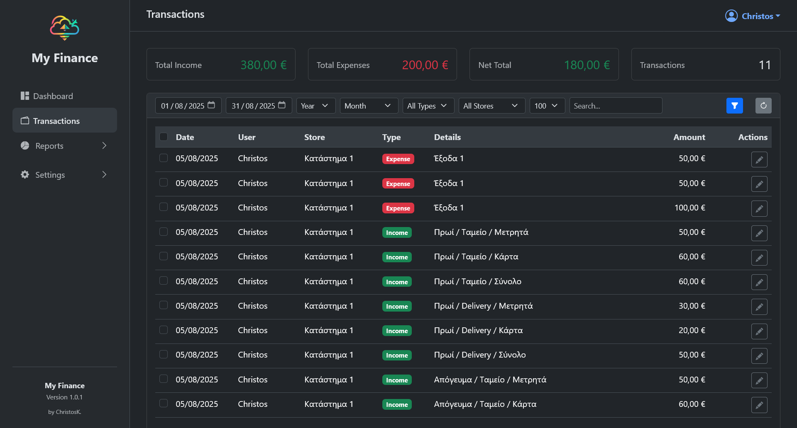
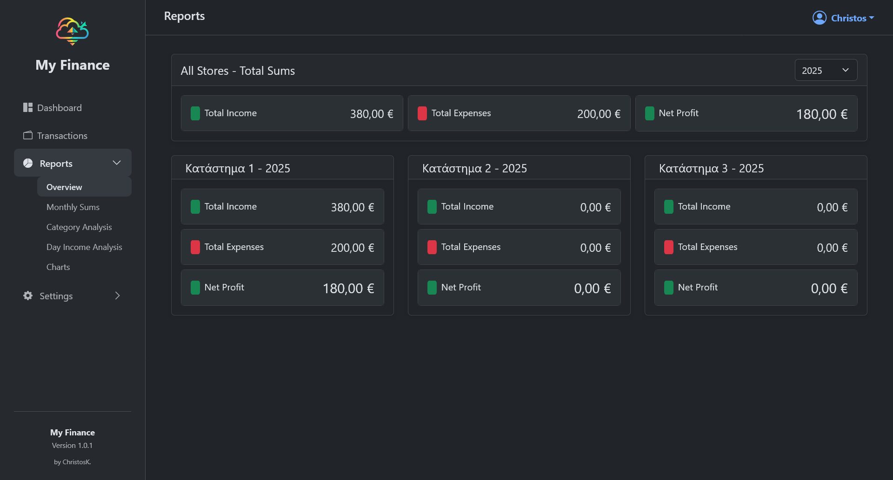
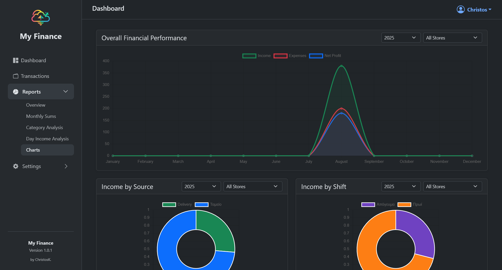

# My Finance - Personal Finance Tracker

My Finance is a modern, self-hosted web application built with the Laravel framework to help you manage your personal finances, track expenses, and monitor your budget across different stores and payment methods.

## Features

-   **Transaction Management:** Log all your income and expenses with details.
-   **Categorization:** Assign expenses to custom categories.
-   **Multi-Store Support:** Track finances across different stores or entities.
-   **Payment Methods:** Define and use various payment methods (Cash, Credit Card, etc.).
-   **Dynamic Settings:** Customize currency, language, and timezone through a user-friendly settings panel.
-   **Web-Based Installer:** A simple, guided setup wizard to get you up and running in minutes.







---

## Requirements

-   PHP >= 8.1
-   Composer
-   MySQL or MariaDB
-   A web server like Apache or Nginx
-   SSH / Terminal access for deployment is highly recommended.

---

## Installation Guide (Live Server)

This guide covers deploying the application to a live server.

### Step 1: Deploy the Code

Log into your server via SSH.

1.  **Navigate to your web root** (e.g., `/home/user/public_html`). Or in the path you want to install.
2.  **Clone the repository.**

    ```bash
    git clone https://github.com/christoskaterini/my-finance-app.git .
    ```

3.  **Install Production Dependencies.**

    ```bash
    composer install --no-dev --optimize-autoloader
    ```

4.  **Set Server Permissions.**
    ```bash
    chmod -R 775 storage bootstrap/cache
    ```

### Step 2: Configure the Web Server

For security, your domain's "Document Root" must be set to the `/public` directory inside your project folder.

-   **Example:** If you installed in `/home/user/public_html`, the document root should be `/home/user/public_html/public`.

### Step 3: Run the Web Installer

1.  Open your web browser and navigate to your domain (`http://yourdomain.com`). The application will **automatically redirect you to the setup wizard**.
2.  Follow the on-screen steps to configure the database and create your administrator account. This is the **recommended method** for creating your first user on a live server.

> **Warning:** The seeder creates a user with the email `christoskanotidis@gmail.com` and the password `password`. **Change this password immediately after your first login.**

### Step 4: Handle File Uploads (Manual Storage Link)

The web installer will attempt to create a "storage link" for file uploads. If this fails due to server restrictions, your images may appear broken. You must create this link manually.

1.  Log into your server terminal.
2.  Navigate to your project's **public** directory:
    ```bash
    cd /path/to/your/project/public
    ```
3.  Run the following Linux command to create the link:
    ```bash
    ln -s ../storage/app/public storage
    ```
    `    This command creates a shortcut named`storage`inside your`public` folder, pointing it to the real storage location.

### Step 5: Final Cleanup (Security)

Once the application is running correctly, you **can delete the installer** for security reasons. (/public/setup)

Your application is now fully installed and secured.

---

## Local Development Setup

1.  **Clone the repository:** `git clone https://github.com/christoskaterini/my-finance-app.git`
2.  **Navigate into the project:** `cd my-finance-app`
3.  **Install all dependencies (including dev tools):** `composer install`
4.  **Create your `.env` file:** `cp .env.example .env`
5.  **Generate an application key:** `php artisan key:generate`
6.  **Configure your `.env` file** with your local database details.
7.  **Run migrations and seeders:** `php artisan migrate --seed`
    -   This will build the database and create a default admin user.

> **Warning:** The seeder creates a user with the email `christoskanotidis@gmail.com` and the password `password`. **Change this password immediately after your first login.**

---

## Updating the Application

1.  First, commit and push your changes to your GitHub repository.
2.  Next, log in to your server via SSH and run your "update cheat sheet" from the project's root directory:

    # Pull the latest code changes from GitHub

    ```bash
    git pull origin main
    ```

    # Install any new or updated packages

    ```bash
    composer install --no-dev --optimize-autoloader
    ```

    # Run any new database migrations

    ```bash
    php artisan migrate --force
    ```

    # Clear cached files to ensure your new code is used

    ```bash
    php artisan optimize:clear
    ```

---

## Troubleshooting

### Error: `proc_open` is not available

If you see this error during `composer install` on a restrictive host, use these commands instead:

1.  Install packages without running scripts:
    ```bash
    composer install --no-dev --no-scripts --optimize-autoloader
    ```
2.  Then, manually run package discovery:
    ```bash
    php artisan package:discover
    ```
    Proceed with the installation as normal.

## Email settings

#### Set your email credentials in the .env file

In next update will be in the Settings/General page

---

## License

This project is open-sourced software licensed under the [MIT license](LICENSE).

```

```
