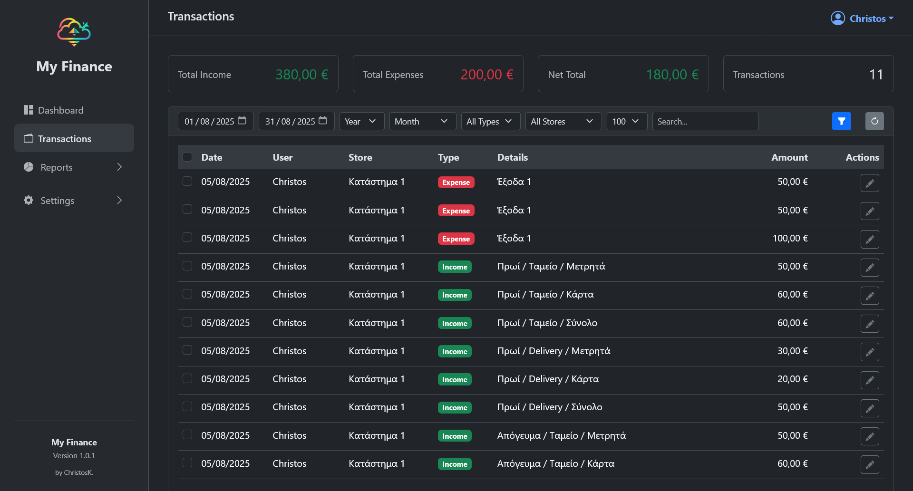
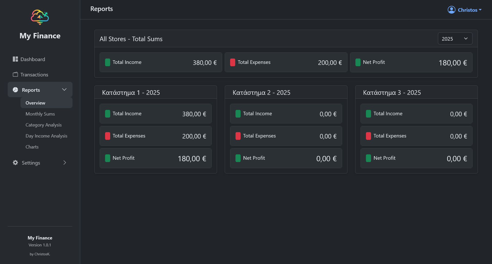
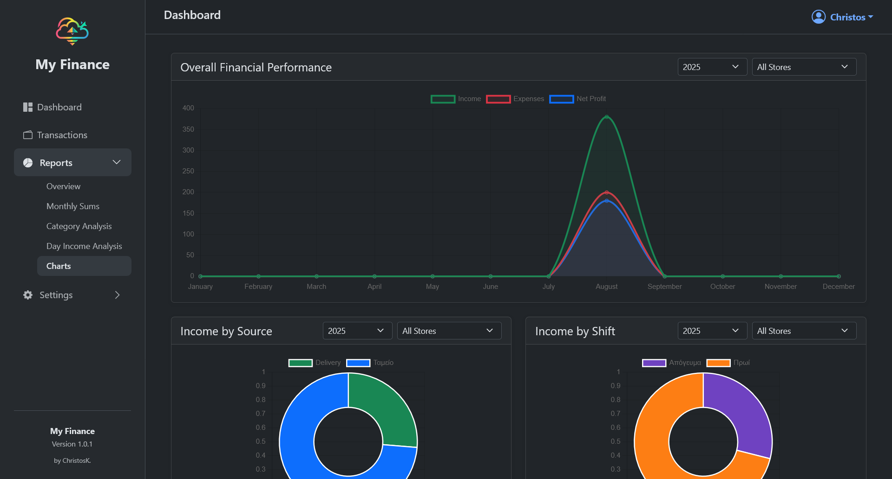

# My Finance - Personal Finance Tracker

My Finance is a modern, self-hosted web application built with the Laravel framework to help you manage your personal finances, track expenses, and monitor your budget across different stores and payment methods.

## Features

-   **Transaction Management:** Log all your income and expenses with detailed metadata.
-   **Spreadsheet Mode (Batch Editor):** Inline editing of multiple transactions directly in the table with smart keyboard navigation (Enter key) and real-time modification tracking.
-   **Bulk Record Creation:** A powerful workflow to add multiple records across different days at once with automated focus-jumping for high-speed data entry.
-   **Global Date Picker:** Integrated **Flatpickr** globally for a premium experience, featuring dark mode support, Greek/English localization, and consistent European date formatting (`dd/mm/yyyy`).
-   **Advanced Reporting & Analysis:** Real-time summary cards and detailed monthly/annual reports with responsive layouts optimized for all devices.
-   **Mobile-First Design:** Optimized filter systems and dashboard components ensure a premium experience on small screens.
-   **Data Integrity:** Robust verification modals for batch saves, unsaved changes, and deletion prevention.
-   **Categorization & Entities:** Assign expenses to custom categories and track finances across different stores or entities.
-   **Web-Based Installer:** A simple, guided setup wizard to get you up and running in minutes.







## Requirements

-   PHP >= 8.1
-   Composer
-   MySQL or MariaDB
-   A web server like Apache or Nginx
-   SSH / Terminal access for deployment is highly recommended.

## Installation Guide (Live Server)

This guide covers deploying the application to a live server.

### Step 1: Deploy the Code

Log into your server via SSH.

1.  **Navigate to your web root** (e.g., `/home/user/public_html`). Or in the path you want to install.
2.  **Clone the repository.**

    ```bash
    git clone https://github.com/christoskaterini/my-finance-app.git .
    ```

3.  **Install Production Dependencies.**

    ```bash
    composer install --no-dev --optimize-autoloader
    ```

4.  **Set Server Permissions.**
    ```bash
    chmod -R 775 storage bootstrap/cache
    ```

### Step 2: Configure the Web Server

For security, your domain's "Document Root" must be set to the `/public` directory inside your project folder.

-   **Example:** If you installed in `/home/user/public_html`, the document root should be `/home/user/public_html/public`.

### Step 3: Run the Web Installer

1.  Open your web browser and navigate to your domain (`http://yourdomain.com`). The application will **automatically redirect you to the setup wizard**.
2.  Follow the on-screen steps to configure the database and create your administrator account. This is the **recommended method** for creating your first user on a live server.

> **Warning:** The seeder creates a user with the email `christoskanotidis@gmail.com` and the password `password`. **Change this password immediately after your first login.**

### Step 4: Handle File Uploads (Manual Storage Link)

The web installer will attempt to create a "storage link" for file uploads. If this fails due to server restrictions, your images may appear broken. You must create this link manually.

1.  Log into your server terminal.
2.  Navigate to your project's **public** directory:
    ```bash
    cd /path/to/your/project/public
    ```
3.  Run the following Linux command to create the link:
    ```bash
    ln -s ../storage/app/public storage
    ```
    This command creates a shortcut named `storage` inside you `public` folder, pointing it to the real storage location.

### Step 5: Final Cleanup (Security)

Once the application is running correctly, you **can delete the installer** for security reasons. (/public/setup)

Your application is now fully installed and secured.

---

## Local Development Setup

1.  **Clone the repository:** `git clone https://github.com/christoskaterini/my-finance-app.git`
2.  **Navigate into the project:** `cd my-finance-app`
3.  **Install all dependencies (including dev tools):** `composer install`
4.  **Create your `.env` file:** `cp .env.example .env`
5.  **Generate an application key:** `php artisan key:generate`
6.  **Configure your `.env` file** with your local database details.
7.  **Run migrations and seeders:** `php artisan migrate --seed`
    -   This will build the database and create a default admin user.

> **Warning:** The seeder creates a user with the email `christoskanotidis@gmail.com` and the password `password`. **Change this password immediately after your first login.**

## Updating the Application (Robust Method)

To ensure a smooth update without errors for your users, follow these steps in your terminal:

1. **Enable Maintenance Mode** (prevents errors while files are being replaced):
    ```bash
    php artisan down
    ```

2. **Pull the latest code changes**:
    ```bash
    git pull origin main
    ```

3. **Install/Update dependencies** (Only needed if packages changed in `composer.json`):
    *Note: If you only changed application code or blade files, you can skip this step.*

    If your server restricts `proc_open` (common on HestiaCP / cPanel), use `--no-scripts` to bypass process execution, then run discovery manually:
    ```bash
    composer install --no-dev --no-scripts --optimize-autoloader
    php artisan package:discover
    ```

4. **Run database migrations**:
    ```bash
    php artisan migrate --force
    ```

5. **Clear and Rebuild Cache**:
    ```bash
    php artisan optimize:clear
    ```

6. **Reset File Permissions** (CRITICAL if you ran the above as `root`):
    Replace `www-data` with your web server's user if different (e.g., `apache` or your username).
    ```bash
    chown -R www-data:www-data .
    chmod -R 775 storage bootstrap/cache
    ```

7. **Disable Maintenance Mode**:
    ```bash
    php artisan up
    ```

## Managing Dependencies (3 Methods)

If you add new packages via `composer require` locally and need to deploy them to the server:

### Method 1: On-Server with `--no-scripts` (Recommended)
This avoids `proc_open` errors while letting Composer handle downloading and autoloading on the server:
```bash
composer install --no-dev --no-scripts --optimize-autoloader
php artisan package:discover
```

### Method 2: Manual `vendor` Upload (From Local Dev / Laragon)
If you prefer not running Composer on the production server:
1. Install packages locally: `composer require <package-name>`
2. Commit and push `composer.json` and `composer.lock` to Git.
3. Zip your local `vendor` folder (`vendor.zip`).
4. Upload `vendor.zip` via SFTP / MobaXterm to your project root on the server.
5. Extract it (replacing the server's `vendor/` directory).
6. Fix permissions:
   ```bash
   chown -R santempougatsa:santempougatsa vendor/
   ```
7. Run cache clear:
   ```bash
   php artisan optimize:clear
   ```

### Method 3: Enable `proc_open` in CLI PHP Configuration
If you want standard `composer install` to run on the server without any extra flags:
1. Find your CLI `php.ini` path:
   ```bash
   php --ini | grep "Loaded Configuration"
   ```
   *(e.g., `/etc/php/8.2/cli/php.ini` or `/etc/php/8.3/cli/php.ini`)*
2. Open that file and find the `disable_functions` line.
3. Remove `proc_open` from the `disable_functions` list and save.
4. Now standard `composer install --no-dev --optimize-autoloader` will execute without errors.

## Email settings

#### Set your email credentials in the .env file

In next update will be in the Settings/General page

## License

This project is open-sourced software licensed under the [MIT license](LICENSE).
